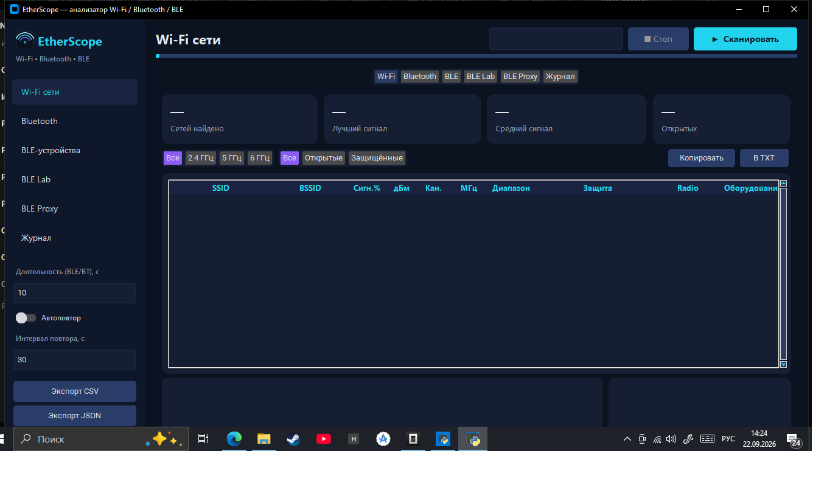

# EtherScope — анализатор Wi-Fi / Bluetooth / BLE


Современное десктоп-приложение (тёмная тема) для анализа беспроводных сетей на Windows.

## Скриншоты



## Возможности

**Wi-Fi** (напрямую через WLAN API с принудительным активным сканом — те же
данные, что видит штатный список сетей Windows): SSID, BSSID, сигнал %,
настоящие дБм из драйвера, канал, частота, диапазон (2.4/5/6 ГГц),
PHY (802.11n/ac/ax…), аутентификация, шифрование, тип сети, скорости,
производитель оборудования точки по OUI
(вендор железа роутера, не интернет-провайдер — его по радиоскану не видно),
метка своего подключения. Запасной путь — netsh. Кнопка «Мой адаптер» — данные своего
подключения. Фильтры по диапазону/защите, график загрузки каналов.

**Bluetooth Classic** (через `BluetoothAPIs.dll`): имя, адрес, класс устройства
с расшифровкой (компьютер/телефон/аудио/периферия…), подключено/запомнено/
аутентифицировано, время последнего визита. Кнопка «Мой радиомодуль».

**BLE** (через `bleak`): имя, адрес, RSSI + история, TX Power, connectable,
компания-производитель, UUID сервисов, данные производителя/сервисов,
счётчик пакетов. Кнопка «Читать GATT» — подключение и глубокий разбор:
имена стандартных UUID, handles, свойства, чтение ВСЕХ читаемых характеристик
и дескрипторов (включая CCCD), HEX+ASCII дампы, расшифровка известных значений
(батарея, имя, производитель, Tx Power…). Live-обновление таблицы
во время сканирования.

**BLE Lab** (вкладка): живая работа с устройством — подключение, дерево
сервисов/характеристик, чтение, запись (с ответом и без), ввод данных как HEX
или текст, подписки на notify/indicate с живым логом ответов. Вся сессия
пишется с метками времени — её можно копировать и сохранять в TXT.
Найденные команды удобно воспроизводить здесь же.

Общее: поиск, статистика-карточки, мини-графики, журнал, автоповтор
сканирования, экспорт CSV/JSON, кнопки «Копировать» и «В TXT» на каждой
вкладке (копируют детали выбранной строки или сохраняют таблицу отчётом).

## Перехват команд официального приложения: BLE Proxy (мост)

Вкладка **BLE Proxy** реализует схему «телефон -> ПК -> устройство»
(идея и проверенная архитектура — из проекта MXW01BleBridge, C#):
ПК публикует локальный GATT-сервис — точный клон сервиса устройства
(те же UUID и свойства, WinRT GattServiceProvider) и рекламирует его.
Телефон считает ПК самим устройством. Мост пересылает чтения/записи/
нотификации настоящему устройству и пишет ВЕСЬ трафик в лог с метками
(копирование и сохранение в TXT).

Как пользоваться: адрес оригинала -> «Прочитать GATT» -> выбрать сервис ->
«Старт моста» -> открыть приложение на телефоне. Пока ПК держит соединение,
оригинал обычно перестаёт рекламироваться, и телефон видит только клон.

Условия: устройство без pairing/bonding (как тот мини-термопринтер),
приложение ищет устройство по сервису, а не по жёсткому MAC.
Важная деталь реализации: реклама стартует только через
`StartAdvertising` с параметрами connectable+discoverable — пустой вызов
молча остаётся в CREATED.

Запасные способы подсмотреть трафик (если мост неприменим):
Android HCI snoop-лог + Wireshark (`btatt`), либо nRF52840-сниффер.

## Запуск

```bat
cd C:\Users\Saymon\Desktop\Project\Job\Scaner
pip install -r requirements.txt
python main.py
```

Требуется Windows 10+, включённый Bluetooth для BT/BLE.
